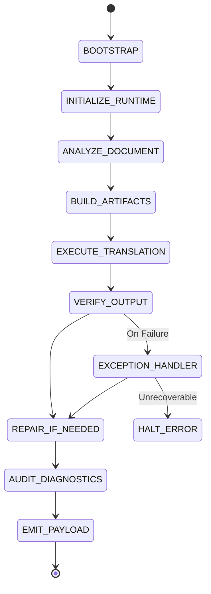

# 🏛️ TRA-SPECIFICATION.md (Translation Runtime Architecture v1.0)

## 1. Scope & Definitions
**Scope:** This specification defines the execution model, instruction set, state management, and conformance criteria for high-fidelity technical translation systems.
**Non-Goals:** This specification does not define specific linguistic rules for any language pair (see `TRA-MODULES`). It does not define UI/UX for human reviewers.
**Key Definitions:**
*   **Kernel:** The immutable execution lifecycle and state machine.
*   **ISA (Instruction Set Architecture):** The atomic operations the engine must perform.
*   **Runtime Context:** The mutable memory state during execution.
*   **Policy Engine:** The deterministic arbitration logic for resolving conflicts.
*   **Conformance Level:** The degree of strictness applied to the output (L1–L4).

## 2. TRA-KERNEL: The Execution Model
The Kernel defines the immutable lifecycle. Every translation request must pass through these states sequentially. State transitions are triggered by the successful completion of ISA instructions.

### 2.1 State Machine


### 2.2 Memory Model
The Runtime maintains four distinct memory segments. Instructions read/write to these segments according to their contracts.

| Segment | Mutability | Purpose | Examples |
| :--- | :--- | :--- | :--- |
| **Immutable Config** | Read-Only | Bootstrap parameters | Language Pair, Domain, Conformance Level |
| **Runtime Context** | Read/Write | Evolving state during execution | Active Glossary, Entity Table, Style Profile |
| **Document Memory** | Read-Only | Source payload | Source Text, Original Markdown Structure |
| **Audit Memory** | Append-Only | Diagnostics and Evidence | Exception Logs, Repair History, Risk Register |

## 3. TRA-ISA: Instruction Set Architecture
The ISA defines the atomic operations. Each instruction has a strict contract: **Inputs**, **Preconditions**, **Outputs**, **Invariants**, and **Failure Conditions**.

### 3.1 Core Instructions

#### `ANALYZE_DOCUMENT`
*   **Inputs:** Source Document, Immutable Config
*   **Outputs:** Document Profile (Type, Audience, Intent), Structural Map
*   **Invariant:** Structural Map node count must equal Source Document node count.
*   **Failure Condition:** Malformed Markdown preventing structural parsing.

#### `BUILD_GLOSSARY`
*   **Inputs:** Source Document, Document Profile, Active Domain Module
*   **Outputs:** Canonical Glossary (Source Term → Target Term), Forbidden Mappings
*   **Invariant:** Every recurring technical term must have exactly one canonical mapping unless marked `context_sensitive`.
*   **Failure Condition:** Conflicting canonical mappings for the same term in the same context.

#### `BUILD_ENTITY_TABLE`
*   **Inputs:** Source Document
*   **Outputs:** Entity Table (Product Names, APIs, CLI Commands, Versions)
*   **Invariant:** Entities are marked `immutable` and excluded from semantic translation.
*   **Failure Condition:** Ambiguous boundary between natural language and entity name.

#### `TRANSLATE_SEGMENT`
*   **Inputs:** Source Segment, Runtime Context (Glossary, Entities, Style)
*   **Outputs:** Target Segment
*   **Invariant:** Target Segment must preserve all factual qualifiers, numbers, and epistemic markers of the Source Segment.
*   **Failure Condition:** Loss of meaning, hallucination of facts, or violation of Glossary invariant.

#### `VERIFY_OUTPUT`
*   **Inputs:** Target Document, Source Document, Runtime Context
*   **Outputs:** Diagnostic Report (List of Violations)
*   **Invariant:** All violations must be categorized by severity (Blocking, Warning, Info).
*   **Failure Condition:** None (Verification always completes, but may flag errors).

#### `REPAIR_SEGMENT`
*   **Inputs:** Target Segment, Source Segment, Diagnostic Violation
*   **Outputs:** Repaired Target Segment
*   **Invariant:** Repair must resolve the specific violation without introducing new ones.
*   **Failure Condition:** Unable to resolve violation without violating a higher-priority Policy.

## 4. TRA-RUNTIME: Execution Context & State
The Runtime Context is the "memory" of the VM. It is initialized during `INITIALIZE_RUNTIME` and updated during `BUILD_ARTIFACTS`.

```yaml
runtime_context:
  configuration:
    language_pair: "ZH -> EN"
    domain: "Security Advisory"
    conformance_level: "L3_STRICT"
  
  document_profile:
    type: "RFC"
    register: "Formal/Authoritative"
    intent: "Standardize Protocol"
  
  glossary_cache:
    - { source: "内核逃逸", target: "kernel escape", status: "canonical" }
    - { source: "成立", target: "Confirmed", status: "canonical" }
  
  entity_table:
    - { name: "RustVMM", type: "Product", mutable: false }
    - { name: "v0.5.0", type: "Version", mutable: false }
  
  style_profile:
    voice: "Passive/Objective"
    sentence_complexity: "High"
    epistemic_mapping: { "highly credible": "highly credible" }
  
  unresolved_ambiguities: []
  execution_log: []
```

## 5. TRA-POLICY: Arbitration & Conflict Resolution
When instructions conflict (e.g., `TRANSLATE_SEGMENT` wants fluency, but `GLOSSARY` demands strict terminology), the Policy Engine resolves the conflict using weighted priorities.

### 5.1 Priority Stack (Immutable)
1.  **Factual Integrity:** Numbers, units, logical conditions, empirical claims.
2.  **Structural Integrity:** Markdown syntax, code blocks, table alignment.
3.  **Entity Preservation:** Product names, APIs, CLI commands.
4.  **Terminological Consistency:** Adherence to Canonical Glossary.
5.  **Epistemic Fidelity:** Preservation of certainty/hedging.
6.  **Target Fluency:** Naturalness and idiomatic flow.

### 5.2 Conflict Resolution Contract
*   **Input:** Two conflicting requirements (e.g., Fluency vs. Terminology).
*   **Process:** Compare priorities in Stack. Higher priority wins.
*   **Output:** Decision + Evidence logged in `Audit Memory`.
*   **Exception:** If priorities are equal (e.g., two valid glossary terms), defer to `Domain Module` heuristics. If still tied, preserve source ambiguity and log as `Warning`.

## 6. TRA-EXCEPTIONS: Error Handling & Recovery
The system must handle exceptions deterministically rather than failing silently or hallucinating.

| Exception Code | Trigger | Recovery Procedure |
| :--- | :--- | :--- |
| `UNKNOWN_TERM` | Term not in Glossary or Domain Module | Log as `Warning`. Preserve source term. Add to `unresolved_ambiguities`. |
| `BROKEN_MARKDOWN` | Source structure cannot be parsed | Log as `Blocking Error`. Attempt best-effort preservation. Halt if critical hierarchy is lost. |
| `CERTAINTY_CONFLICT` | Source hedging conflicts with Target norms | Log as `Warning`. Prioritize Epistemic Fidelity (Priority 5). Preserve source hedging. |
| `ENTITY_AMBIGUITY` | Unclear if text is Entity or Natural Language | Log as `Warning`. Treat as Entity (Immutable) to prevent accidental translation. |
| `GLOSSARY_CONFLICT` | Two different canonical mappings for same term | Log as `Blocking Error`. Use first occurrence as canonical. Flag subsequent occurrences for manual review. |

## 7. TRA-QA: Verification & Diagnostics
The `AUDIT_DIAGNOSTICS` state produces a standardized diagnostic report. It does not use self-scoring. It uses evidence-based logging.

```yaml
diagnostics:
  - severity: "BLOCKING"
    subsystem: "STRUCTURAL_VERIFICATION"
    issue: "Table row count mismatch"
    evidence: "Source: 5 rows, Target: 4 rows"
    action: "REPAIR_ATTEMPTED"
    repaired: true

  - severity: "WARNING"
    subsystem: "TERMINOLOGY_VERIFICATION"
    issue: "Unresolved ambiguity"
    evidence: "Term '执行环境' mapped to 'execution environment', but 'runtime' is also common in this domain."
    action: "PRESERVED_SOURCE_DECISION"
    repaired: false

  - severity: "INFO"
    subsystem: "STYLE_VERIFICATION"
    issue: "Passive voice usage"
    evidence: "12 passive constructions used in active-voice domain."
    action: "LOGGED_ONLY"
    repaired: false
```

## 8. TRA-CONFORMANCE: Compliance Levels
Systems can operate at different levels of strictness.

*   **Level 1 (Basic):** Preserves Meaning and Formatting. Allows minor terminology drift.
*   **Level 2 (Professional):** Preserves Meaning, Formatting, and Terminology. Basic QA.
*   **Level 3 (Strict):** Full TRA compliance. Explicit Glossary, Entity Table, and Arbitration. Diagnostic Reporting required.
*   **Level 4 (Forensic):** Level 3 + Line-by-line evidence tracing. Every translation decision is logged with its Policy justification. Used for legal/security audits.

## 9. TRA-MODULES: Extension Registry
Modules are plug-ins that provide domain-specific or language-specific data to the Runtime. They do not alter the Kernel or ISA.

*   **Language Modules (`zh-en.md`, `en-zh.md`):** Provide linguistic bridges (e.g., Parataxis → Hypotaxis rules).
*   **Domain Modules (`security.md`, `academic.md`):** Provide specialized glossaries and style profiles.
*   **Formatting Modules (`markdown_strict.md`):** Provide rules for specific markup languages.
